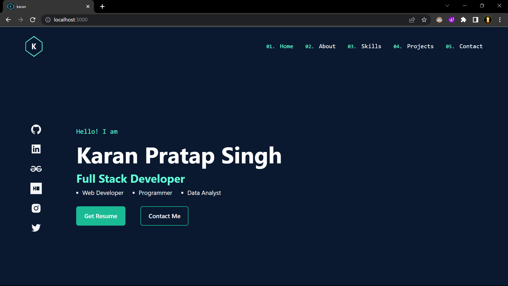

# **Personal Portfolio Website**

## **Overview**
I had heared a lot from seniors and other fellow developers that a developer should have a portfolio website through which he can demostrate and present his skills, also can provide people a way to connect with himself. 

After checking some portfolio websites, I decided to create my own and this project is a result of that.

## **Technology Used**
1. ReactJS
2. Tailwind CSS

## **Some key features**
1. A simple and easy to use user interface.
2. Skills page has some dynamic bubbles for showcasing my skills.
3. Visitor can switch between normal page view and can also see it through the dynamically moving skill bubbles on skill page.
4. Working contact form, so that visitor can communicate with me.
5. Mobile responsive for both mobile and pc users.

## **Output**
1. **Output 1**

2. **Output 2**

3. **Output 3**

4. **Output 4**

5. **Output 5**

## **Live Link**
